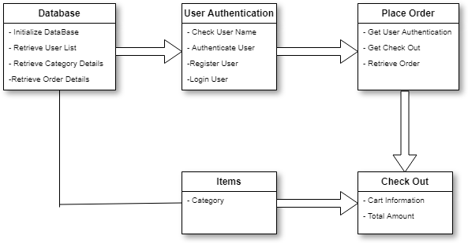

**FASHION STORE**

Prepared by:

- Apurva Patil
- Sanjana Nalawde
- Anita Yadav

Abstract

**Online shopping** is a form of electronic commerce which allows consumers to directly buy goods or services from a seller over the Internet using a web browser.

` `Consumers find a product of interest by visiting the website of the retailer directly or by searching among alternative vendors using a shopping search engine, which displays the same product's availability and pricing at different e-retailers. 

As of 2016, customers can shop online using a range of different computers and devices, including desktop computers, laptops, tablet computers and Smartphone’s.

TABLE OF CONTENTS

- **Introduction**
- **System requirement**
- Software details 
- Hardware details
- **Modular description**
- Login Page
- Registration Page
- Men’s Wear (Shirt, Jeans, Shoes)
- Women’s Wear (Shirt, Jeans, Shoes)
- Kid’s Wear (Shirt, Jeans, Shoes)
- **System Implementation**	
- **Graphical User Interface**
- **Database Schema**
- **Conclusion**
- **Reference**

**INTRODUCTION**

**Online shopping** is the process of buying goods and services from merchants over the Internet. From a long time, merchants have sought to sell their products to people who spend time online. Shoppers can visit web stores from the comfort of their homes and shop as they sit in front of the computer.

Consumers can buy a huge variety of items from online stores, and just about anything can be purchased from companies that provide their products online. 

Our online shopping store deals with selling of clothes and apparels. Many people choose to shop online because of the convenience. A person only has to log onto the Internet, visit the store's website, and choose the items he/she desires. The items are held in a virtual shopping cart until she is ready to make her purchase. The shopper can remain in their pyjamas as he/she does their shopping, and the process can be conducted in the wee hours of the morning or late into the night. Online stores almost never close.

**SYSTEM REQUIREMENT**

- **SOFTWARE DETAILS**
- Front End- Java(jdk1.4.1) and above
- OS-Windows
- Back End- Oracle

- **HARDWARE DETAILS**
- Processor                    1.0GHZ
- Hard Disk                     40GB
- RAM                              512MB
- Floppy Disk Drive       1.44MB

**MODULAR DESCRIPTION**

- Login Page
- Registration Page
- Men’s Wear (Shirt, Jeans, Shoes)
- Women’s Wear (Shirt, Jeans, Shoes)
- Kid’s Wear (Shirt, Jeans, Shoes)

Registration Page:

With this page the user can create an account for online shopping .A new account is opened with the following details of the customer:

- First Name
- Last name
- Username
- Contact no
- Address
- Email id

Login Page:

With the help of this page the user can log into his account. The user has to enter his username and password.

Men’s Wear:

The first page consists of different offers. After this page the user can shop from the following categories:

- T-Shirt
- Jeans
- Shoes

Women’s Wear:

The first page consists of different offers. After this page the user can shop from the following categories:

- Dresses
- Jeans
- Shoes

Kids Wear:

The first page consists of different offers. After this page the user can shop from the following categories:

- Girls
- Boys

**IMPLEMENTATION**

Implementation is the realization, application, execution of   plan, idea, model, design and specification.

The design must be translated in to machine readable form. The code generation step performs the tasks. If a design is performed in a detailed manner, code generation can be accomplished systematically.

**GRAPHICAL USER INTERFACE**

A Well –designed interface improves the user perception of the content or services. It needs not to be flashy but it should be efficient.

The various documents that are maintained are used to analyze the user interface that will interact with the software.

This software consists of many modules and these modules consist of various sub modules, which provides the user with various facilities. It is user friendly and simple to use.

Class Diagram:

ER Diagram:

**DATABASE SCHEMA**

The database is used to store the details of the customer like his username, address and various other details.

**CONCLUSION**

Due to fast moving lifestyle, online shopping has been growing drastically in India. With developed internet penetration, increasing adoption of devices like smart phones, tablets, laptops, and access to the Internet and the shift in buying behaviour among the consumers has contributed to the rapid growth of the online consumer base.

The increase of online shopping has become a trendy way for consumers to shop over internet.

Our Project "Fashion Store Management" is completely based on the online shopping of the clothes including the jeans and T-shirt.

It is user friendly such that the customer can select any product from the given list of area available and get the desired product.

They are able to get the product any time and from anywhere, which makes it easy for the users to shop.

ScreenShots:

